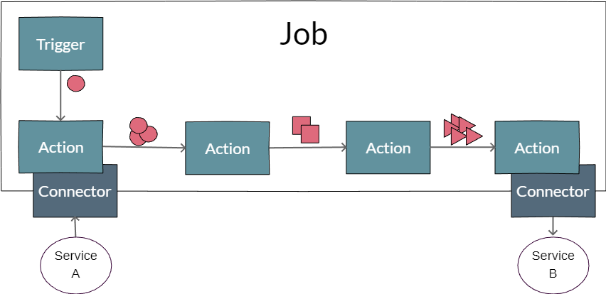

# What is Igor?
Igor is a tool for managing 'continuous workarounds'.

It provides an easy to use, reliable place where you can put all those workarounds, which would 
otherwise be solved by scattered scripts or code fragments across your applications and services. 

It is similar to [Node-RED](https://nodered.org/), [Huginn](https://github.com/huginn/huginn) or [Beehive](https://github.com/muesli/beehive), 
i.e. it provides a "low-code" environment for developers. 

It's written in Java using [Spring Boot](https://spring.io/projects/spring-boot) and provides an easy-to-use web-frontend written in [vue.js](https://vuejs.org/).

# What can it do?

Continuous workarounds are configured in igor using **jobs**.

A job ist triggered by a **trigger**, e.g. a CRON trigger starting the job at a regular interval or an event that is received by the trigger.
The trigger creates an initial data item to start the job.

The data item is passed to different, configurable **actions**, that modify the data to the user's needs.
Actions can also be used to load data from, or store modified data items in, external services using **connectors** for these services..



# Quick Start
Install igor using docker:
``` sh
# use docker to get the latest, stable version:
docker run --name igor -p8080:8080 arassec/igor
```
Igor's web interface should now be available at: [http://localhost:8080](http://localhost:8080)

# Connectors

There are currently connectors for the following protocols and services:

File Handling | Message Handling | Web
---|---|---
FTP | RabbitMQ | HTTP(S)
FTPS | E-Mail |
Local Filesystem | | 
SCP |  |
SFTP | |

# Contact
You can contact me via e-mail under andreas.sensen@arassec.com

If you found a bug or have a feature request, don't hesitate to create an issue at [GitHub](https://github.com/arassec/igor/issues).
