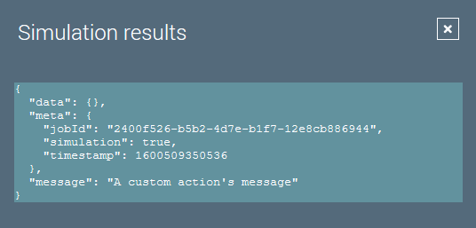

# Custom Actions

## Introduction
Actions manipulate the data items supplied to them.
There is one method a custom action must implement:

``` java
/**
 * Executes the action.
 *
 * @param data         The data the action will work with.
 * @param jobExecution The job's execution log.
 *
 * @return {@code true}, if the data should further be processed, 
 * {@code false} otherwise.
 */
List<Map<String, Object>> process(Map<String, Object> data, JobExecution jobExecution);
```
The method gets the original data item as input and returns a list of result data items for the next action to process.

## Example Code
A custom action should extend `BaseAction` to get sensible defaults for the methods to override.

The code of our custom action looks like this:

``` java
/**
 * A custom action that adds a message to the data items.
 */
@IgorComponent
public class CustomAction extends BaseAction {

    /**
     * A parameter switching the message on or off.
     */
    @IgorParam(defaultValue = "true")
    private boolean addMessage;

    /**
     * Creates a new component instance.
     */
    public CustomAction() {
        super("Demo-Actions", "Custom-Action");
    }

    /**
     * {@inheritDoc}
     */
    @Override
    public List<Map<String, Object>> process(Map<String, Object> data, 
                                             JobExecution jobExecution) {
        if (addMessage) {
            data.put("message", "A custom action's message");
        }
        return List.of(data);
    }

}
```

This action will be available in igor under the Category- and Type-ID we set in the constructor.


The processed data item of our action looks like this, if the checkbos is selected by the user:


