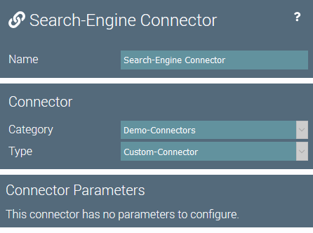
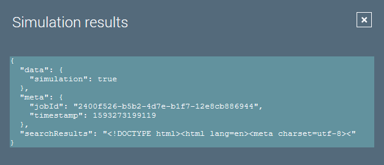

# Custom Connectors

## Introduction
Connectors are the key components to connect igor to the outside world. 
There is only one method a custom connector must implement:

``` java
/**
 * Tests the connector's configuration.
 */
void testConfiguration();
```
When the user hits the  button in the connector editor, this method is executed.
You should implement a reasonable configuration check, e.g. connect to a service you are adding.
In case the configuration is not working, an Exception should be thrown.

## Example Code
A custom connector should extend `BaseConnector` to get sensible defaults for the methods to override.

The code of our custom connector looks like this:

``` java
/**
 * A basic example connector querying google, to demonstrate the usage 
 * of igor connectors.
 */
@IgorComponent
public class CustomConnector extends BaseConnector {

    /**
     * Creates a new component instance.
     */
    public CustomConnector() {
        super("Demo-Connectors", "Custom-Connector");
    }

    /**
     * {@inheritDoc}
     */
    @Override
    public void testConfiguration() {
        // The result is ignored, we only want to test the connection...
        getGoogleResult("igor");
    }

    /**
     * Returns the google search result for the given parameter.
     *
     * @return The search result.
     */
    @IgorSimulationSafe
    public String getGoogleResult(String searchParameter) {
        HttpClient client = HttpClient.newBuilder().build();
        HttpRequest request = HttpRequest.newBuilder()
                .uri(URI.create("https://www.google.com/search?q=" + searchParameter))
                .GET().build();
        try {
            HttpResponse<String> response = client.send(
                    request, HttpResponse.BodyHandlers.ofString());
            return response.body();
        } catch (IOException e) {
            throw new IgorException("Connection failed!", e);
        } catch (InterruptedException e) {
            Thread.currentThread().interrupt();
            throw new IgorException("Interrupted!", e);
        }
    }

}
```
Note that the `getGoogleResult()` method can be annoted with `@IgorSimulationSafe` since the search query can be executed during simulations without altering the data.

This connector will be available in igor under the Category- and Type-ID we set in the constructor.



## Usage

In order to use the new connector we set it as parameter in a new action:

``` java
/**
 * A custom action adding a google search result to the data items.
 */
@IgorComponent
public class SearchAction extends BaseAction {

    /**
     * The connector providing the search result.
     */
    @NotNull
    @IgorParam
    private CustomConnector connector;

    /**
     * Creates a new component instance.
     */
    public SearchAction() {
        super("Demo-Actions", "Search-Action");
    }

    /**
     * {@inheritDoc}
     */
    @Override
    public List<Map<String, Object>> process(Map<String, Object> data,
                                             JobExecution jobExecution) {
        String confetti = connector.getGoogleResult("confetti");
        // Instead of parsing the HTML, we simply return the first 50
        // characters... It's a demo after all.
        data.put("searchResults", confetti.substring(0, 50));
        return List.of(data);
    }

}
```

This action will be available in igor under the Category- and Type-ID we set in the constructor.


The new connector instance can be configured as parameter for the action.

The processed data item of our action then looks like this:


