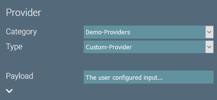
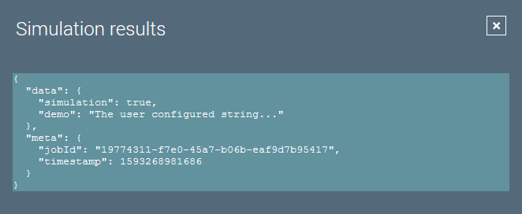

# Custom Providers

## Introduction
Providers create the data items the actions work with.
There are two methods that must be implemented in custom providers:

``` java
/**
 * Returns {@code true}, if there is further data to process.
 *
 * @return {@code true}, if there is data to process, {@code false} otherwise.
 */
boolean hasNext();

/**
 * Returns the next data item to process.
 *
 * @return A JSON-Object that contains the data to process.
 */
Map<String, Object> next();
```

## Example Code
A custom provider should extend `BaseProvider` to get sensible defaults for the methods to override.

The code of our custom provider looks like this:

``` java
/**
 * A custom provider serving the supplied string as data item.
 */
@IgorComponent
public class CustomProvider extends BaseProvider {

    /**
     * The payload we want in the data item.
     */
    @NotEmpty
    @IgorParam
    private String payload;

    /**
     * Counter to limit the number of data items.
     */
    private int counter;

    /**
     * Creates a new component instance.
     */
    public CustomProvider() {
        super("Demo-Providers", "Custom-Provider");
    }

    /**
     * {@inheritDoc}
     */
    @Override
    public boolean hasNext() {
        return ++counter == 1;
    }

    /**
     * {@inheritDoc}
     */
    @Override
    public Map<String, Object> next() {
        // Don't use Map.of() since actions might want to manipulate the map!
        Map<String, Object> item = new HashMap<>();
        item.put("demo", payload);
        return item;
    }

}
```

The JSON object returned by the `next()` method will be added to the data item under the `data` attribute.
The data item's meta data is added automatically by igor.

This provider will be available in igor under the Category- and Type-ID we set in the constructor.



The resulting data item of our provider looks like this:



