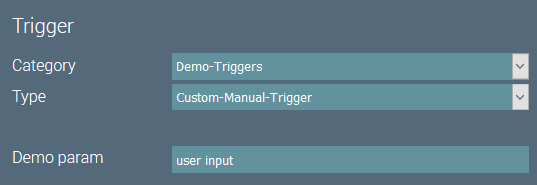
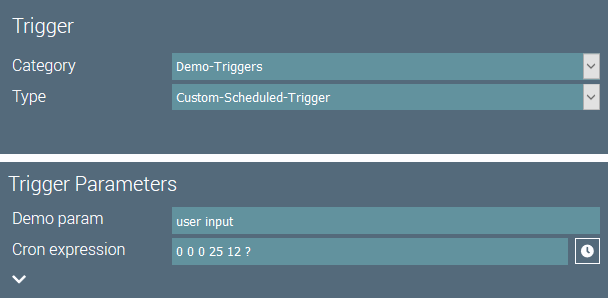
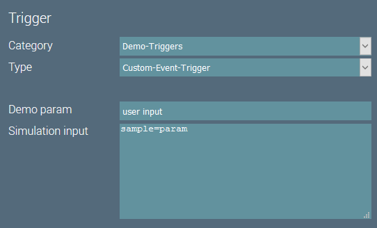

# Custom Triggers

## Introduction
Triggers start an igor job. 
At the moment, there are three kinds of triggers available in igor:
- Triggers for manual execution
- Triggers that schedule a job based on a CRON expression
- Event based triggers

## Methods
There should usually be no need to create a custom trigger.
However, the following methods might be useful and can be implemented by custom triggers:

``` java
/**
 * Returns meta-data from the trigger that is added to each data item.
 *
 * @return The trigger's meta-data.
 */
Map<String, Object> getMetaData();

/**
 * Returns data from the trigger that is added to each data item.
 *
 * @return Trigger-data.
 */
Map<String, Object> getData();
```

Additionally, custom event based triggers might be usefull to support event sources that igor doesn't support natively.
In this case the custom trigger can contain the code to listen for events.
If such an event arrives, the custom trigger must call the following method in order for the job to process the event:

``` java
/**
 * Processes the supplied event data and hands it over to the job.
 *
 * @param eventData The event's data.
 */
void processEvent(Map<String, Object> eventData);
```

## Custom Manual Trigger
A custom trigger for manual execution should extend `BaseTrigger` to get sensible defaults for the methods to override.

The code of our custom manual trigger looks like this:

``` java
/**
 * A custom trigger for manual job execution.
 */
@IgorComponent
public class CustomManualTrigger extends BaseTrigger {

    /**
     * A sample parameter.
     */
    @IgorParam
    private String demoParam;

    /**
     * Creates a new component instance.
     */
    public CustomManualTrigger() {
        super("Demo-Triggers", "Custom-Manual-Trigger");
    }

    /**
     * {@inheritDoc}
     */
    @Override
    public Map<String, Object> getMetaData() {
        return Map.of("demoParam", demoParam);
    }

}
```

This trigger will be available in igor under the Category- and Type-ID we set in the constructor.



The configured parameter will be added to each data item in the `metaData` segment.

``` json
{
  "data": {},
  "meta": {
    "jobId": "2400f526-b5b2-4d7e-b1f7-12e8cb886944",
    "demoParam": "user input",
    "simulation": true,
    "timestamp": 1599587099204
  }
}
```

## Custom Scheduled Trigger
A custom scheduled trigger should extend `BaseScheduledTrigger` to get sensible defaults for the methods to override.

The code of our custom scheduled trigger looks like this:

``` java
/**
 * A custom trigger for scheduled job execution.
 */
@IgorComponent
public class CustomScheduledTrigger extends BaseScheduledTrigger {

    /**
     * A sample parameter.
     */
    @IgorParam
    private String demoParam;

    /**
     * Creates a new component instance.
     */
    public CustomScheduledTrigger() {
        super("Demo-Triggers", "Custom-Scheduled-Trigger");
    }

    /**
     * {@inheritDoc}
     */
    @Override
    public Map<String, Object> getData() {
        return Map.of("demoParam", demoParam);
    }

}
```

This trigger will be available under the same category as the previous one.



According to our code, the configured parameter will be added to each data item in the `data` segment.

``` json
{
  "data": {
    "demoParam": "user input"
  },
  "meta": {
    "jobId": "2400f526-b5b2-4d7e-b1f7-12e8cb886944",
    "simulation": true,
    "timestamp": 1599837870589
  }
}
```

## Custom Event Trigger
A custom event trigger should extend `BaseEventTrigger` to get sensible defaults for the methods to override.

The code of our custom event trigger looks like this:

``` java
/**
 * A custom trigger for manual job execution.
 */
@IgorComponent
public class CustomManualTrigger extends BaseTrigger {

    /**
     * A sample parameter.
     */
    @IgorParam
    private String demoParam;

    /**
     * Creates a new component instance.
     */
    public CustomManualTrigger() {
        super("Demo-Triggers", "Custom-Manual-Trigger");
    }

    /**
     * {@inheritDoc}
     */
    @Override
    public Map<String, Object> getMetaData() {
        return Map.of("demoParam", demoParam);
    }

}
```

Again, the trigger will be available under the category as the previous two.



Since scheduled triggers add the configured simulation input to the data items, the processed data item in a
simulated job execution will contain both configurations in the `data` segment: 

``` json
{
  "data": {
    "demoParam": "user input",
    "sample": "parameter"
  },
  "meta": {
    "jobId": "a1f005d2-7ffc-4e0d-a2c9-9ea7e51e16c8",
    "demoParam": "user input",
    "simulation": true,
    "timestamp": 1599838823466
  }
}
```
