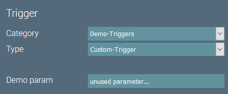

# Custom Triggers

## Introduction
Triggers start an igor job. 
At the moment, there are only two kinds of triggers available in igor:
- Triggers for manual execution
- Triggers that schedule a job based on a CRON expression

::: tip
Until igor supports other types of triggers, e.g. event based triggers, there is not much you can do in a custom trigger.
So this documentation is for future expansion and completeness purposes at the moment!
:::

## Example Code
A custom trigger should extend `BaseTrigger` to get sensible defaults for the methods to override.

The code of our custom trigger looks like this:

``` java
/**
 * A custom trigger.
 */
@IgorComponent
public class CustomTrigger extends BaseTrigger {

    /**
     * A sample parameter.
     */
    @IgorParam
    private String demoParam;

    /**
     * Creates a new component instance.
     */
    public CustomTrigger() {
        super("Demo-Triggers", "Custom-Trigger");
    }

}
```

This trigger will be available in igor under the Category- and Type-ID we set in the constructor.


