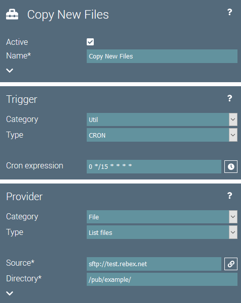
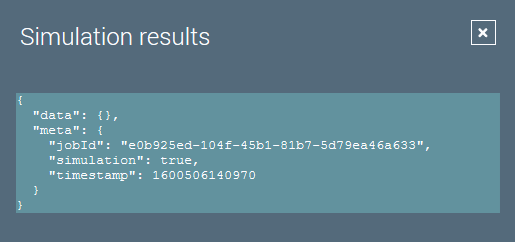
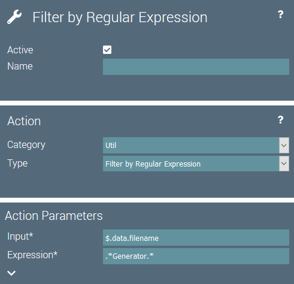
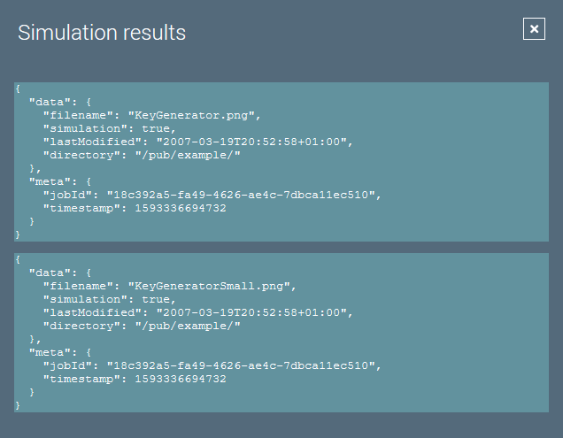
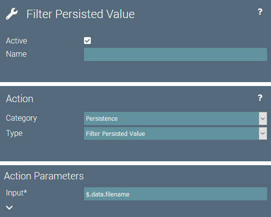
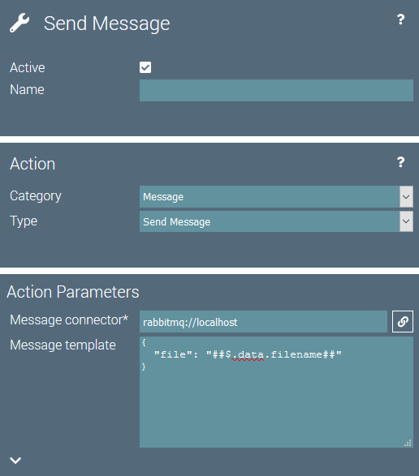
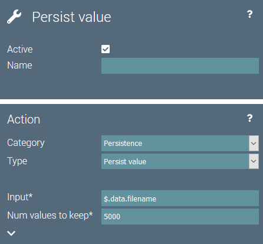
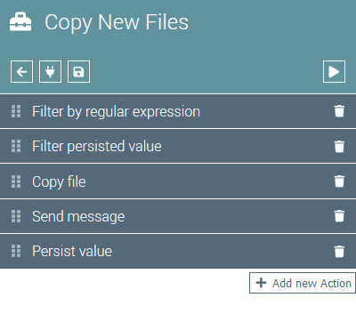

# 'Copy New Files' Example

## Introduction
This example shows how to solve the following task with igor:

::: tip Task
Regularly copy new files on a remote server to a destination server.
Only files with names matching a certain pattern should be copied.
Each file should be copied only once.
A message should be sent to an application to further process each newly copied file. 
:::

## General Idea
The following ist a rough idea of how to configure a job in igor to solve the task.

- Use a CRON expression to regularly check for new files.
- List all files on the remote server
- Filter files with names not matching the desired pattern
- Ignore already copied files
- Copy new files to the destination system
- Send a message to the target application waiting for new files

## Job Configuration
In order to implement the general idea with igor, we will create a new job with the following configuration.

### Trigger and Provider
We configure a **CRON trigger** and set the expression to `0 */15 * * * *`. 
Thus, igor will start the job every 15 minutes.

The **'List Files' provider** will list all files in the configured directory and create data items from them.
In this example I chose the publicly available SFTP server at [test.rebex.net](https://test.rebex.net/).

The configuration of the job then looks like this:

The resulting data items look like this:

### Filename Filter
The job's first action filters the data items based on the file name.
In the example, we only want files containing the word "Generator" in the filename to be copied.

The **'Filter by Regular Expression' action** can be used for this. 
Since we want to filter by filename, we set the input parameter to `$.data.filename`. 
The expression parameter can be set to `.*Generator.*`

The action configuration looks like this:

The resulting data items look like this:

### Filter Already Copied Files
In order to filter already processed files we use igor's persistence actions.

The **'Filter Persisted Value' action** filters all data items from the stream that contain a value, that is already persisted in igor's datastore.
The filter operates on the filename, so we configure the input parameter to `$.data.filename`.

We will add persisting the values later, after we successfully copied the file. 
Here we only configure the filtering of already persisted values.

The action configuration looks like this:

Since we have nothing persisted yet, the data items will not change during a simulated job execution.

### Copy Files
The data items that remain in the stream contain those files we want to copy.

The **'Copy File' action** can do this for us. 
The source service has to be the same as the one we used in the 'List Files' provider configuration.
The target service is a NAS in the local network, that I configured as SCP file connector.

The action configuration looks like this:

Again, the action doesn't change anything on the data items in the stream.

### Send Message
After the file has been copied a message should be sent to trigger another service to start processing the new file.

The **'Send Message' action** can be used for this.
I configured a sample RabbitMQ server and used it as connector in the action's configuration.
The message contains simply the filename.

The action configuration looks like this:

Once again, the action doesn't change anything on the data items in the stream.

### Save Filename
In order for the 'Filter Persisted Value' action to work, we now have to save the filename of all copied files to igor's datastore.
During the next job run, those filenames will then be filtered and the files won't be copied again.

The **'Persist Value' action** stores a value from the data item in igor's datastore.
As input parameter we set the data item's filename by configuring `$.data.filename`.
Since we don't want to store an unbounded number of values in igor's datastore, we limit the number of filenames to keep to `5000`.
This value has to be adopted according to the number of files on the server and how often filenames might e.g. get recycled.
The action configuration looks like this:

## Conclusion
That's it. The final job configuration is complete and looks like this:

