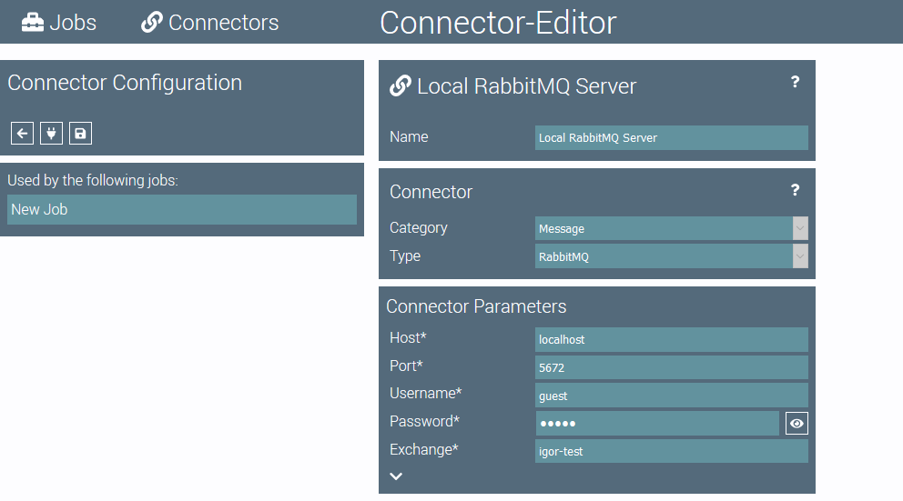
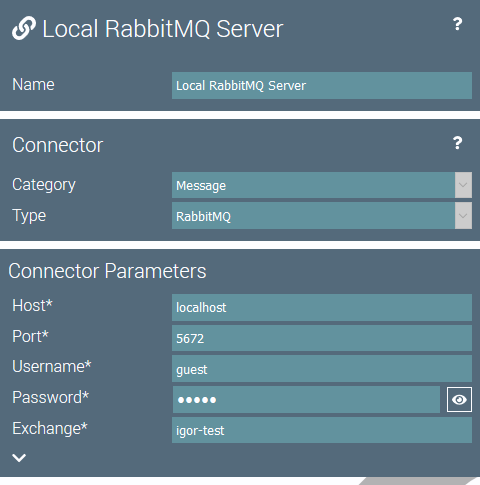

# Connector Editor

The connector editor is used to configure connectors.
It is split into two parts.

## Connector Configuration

The connector configuration on the left side of the page is used to configure the connector.

The top element contains buttons for the following actions:

 Navigates back to the job configuration from which the connector editor was opened.

 Tests the connector configuration and displays the results.

 Saves the connector.

Below the top element is the list of jobs that use this connector.
By clicking on an element in the list you can jump directly into the job editor for the corresponding job. 
 
## Parameters Editor

The parameters editor in the middle of the page contains all configuration parameters for the selected connector.

By selecting different categories and types, the configuration parameters will change accordingly.

The  button can be used to display the online help for the selected connector.
