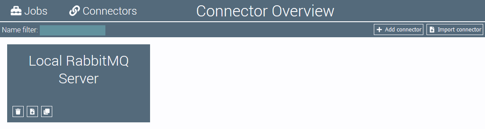
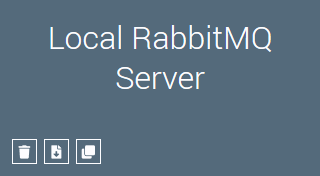

# Connector Overview

The connector overview displays all configured connectors. 
Connectors can be managed here, e.g. created, duplicated or exported.

## Action Bar

On top of the page is the overview's action bar. 

On the left is a filter element:
- **Name Filter:** The name filter can be used to filter the displayed connectors by their name.

On the right part of the action bar are buttons to perform the following actions:

 Opens the connector editor to create a new connector.

 Opens the dialog for importing connectors.

## Connector Tiles

The main element of the connector overview are the connector tiles.
Each connector is displayed in a separate tile.
Clicking on the tile opens the connector editor for the corresponding connector.

The tile contains the following buttons to modify the connector:

 Deletes the connector.

 Exports the connector as JSON text file.

 Opens the connector editor with a duplicated connector configuration.
