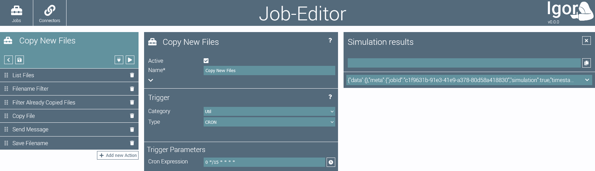
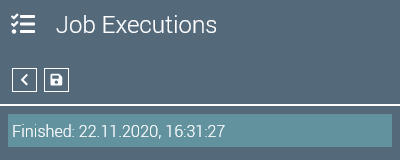
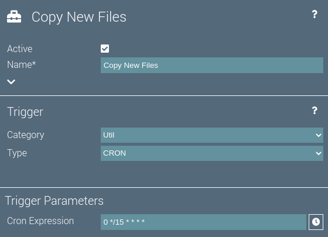
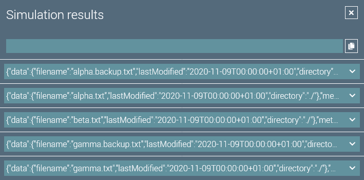

# Job Editor

The job editor is used to configure a job. 
Additionally the execution history of the job is listed here.
The editor is split into three main sections.

## Job Configuration

The job configuration on the left side of the page is used to configure the job.

The top element contains buttons for the following actions:

 Toggles the view of the job configuration and the list of job executions.

 Runs the job in **simulation** mode. The results are displayed in the simulation results element.

 Saves the job.

 Runs the job.

The 'run job' button might be disabled for the following reasons, indicated by the button's icon:

 The job is inactive.

 The job is waiting for a free execution slot.

 The job is already running.

 The job is triggered by events and already active.

 The job failed previously and is fault-intolerant.

Below the top element is the list of actions. 
The list can be ordered by drag-and-drop.
new Actions can be added to the job by pressing the  button.

## Job Executions

The  opens or closes the job execution history.
It contains an entry for each past job execution.

The number of saved execution entries can be configured for the job.
Details can be opened by clicking on an execution entry.

If an execution failed, its entry is red.
By clicking the  button, the job execution can manually be marked as resolved.

::: tip
A job will not run if failed executions exist. 
You can either resolve the failed executions manually or configure the job to be fault tolerant (which is an advanced job configuration parameter).

Fault tolerant jobs are executed even if previous executions failed. 
A successful job execution will automatically mark all previously failed executions as resolved.
:::
 
## Parameters Editor

The parameters editor in the middle of the page contains all configuration parameters for the selected component.

By selecting different categories and types for the components, the configuration parameters will change accordingly.

If an action is selected, the configuration parameters of the action are displayed.

The  button can be used to display the online help for the selected component.

## Simulation Results

On the right of the page, the simulation results are displayed.

Each data item of the simulated job run is shown as it is supplied to the selected component.

By clicking on keys in the result JSON, a mustache template for the respective key is entered into the input above the simulation results.

A click on  copies the mustache template to the clipboard.
