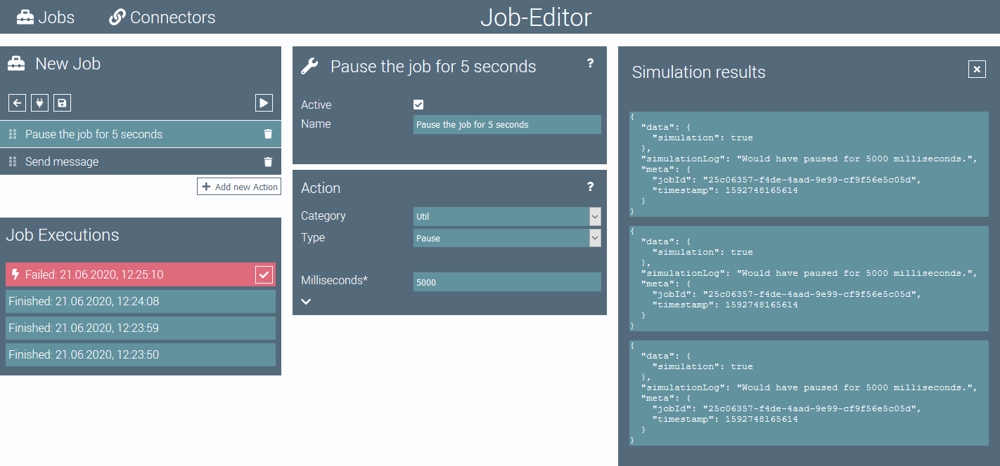
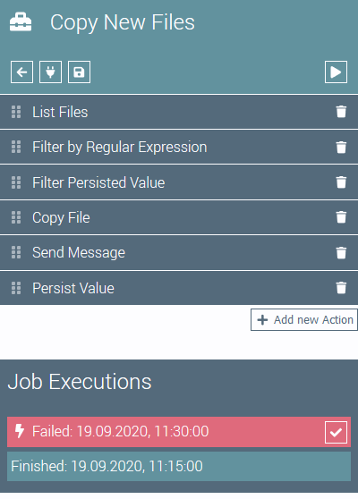
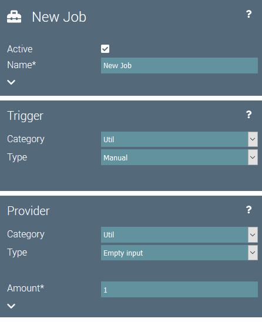
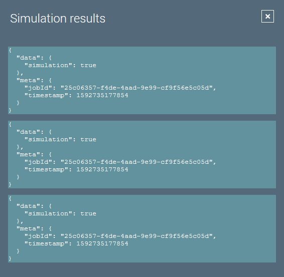

# Job Editor

The job editor is used to configure a job. 
Additionally the execution history of the job is listed here.
The editor is split into three main sections.

## Job Configuration

The job configuration on the left side of the page is used to configure the job.

The top element contains buttons for the following actions:

 Navigates back to the job overview page.

 Runs the job in **simulation** mode. The results are displayed in the simulation results element.

 Saves the job.

 Runs the job.

Below the top element is the list of actions. 
The list can be ordered by drag-and-drop.
new Actions can be added to the job by pressing the  button.

On the bottom of the job configuration lies the job execution history.
It contains an entry for the last job executions.
The number of displayed executions can be configured for the job.
Details can be opened by clicking on an execution entry.

If an execution failed, its entry is red.
By clicking the  button, the job execution can manually be marked as resolved and will no longer be displayed in red.
 
## Parameters Editor

The parameters editor in the middle of the page contains all configuration parameters for the selected component.

By selecting different categories and types for the components, the configuration parameters will change accordingly.

If an action is selected, the configuration parameters of the action are displayed.

The  button can be used to display the online help for the selected component.

## Simulation Results

On the right of the page, the simulation results are displayed.

Each data item of the simulated job run is shown as it is supplied to the selected component.