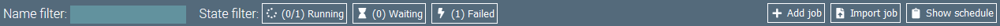
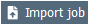

# Job Overview

The job overview is a dashboard displaying all configured jobs and the status of their last execution.
Jobs can be managed here, e.g. created, duplicated or imported from previous exports.

## Action Bar

On top of the page is the overview's action bar. 

On the left part are filter elements:
- **Name Filter:** The name filter can be used to filter the displayed jobs by their name.
- **State Filter:** The buttons of the state filter can be used to filter jobs by their execution state.

On the right part of the action bar are buttons to perform the following actions:

 Opens the job editor to create a new job.

 Opens the dialog for importing jobs.

 Opens the schedule that displays the next execution of jobs, that are triggered by CRON expressions.

## Job Tiles

The main element of the job overview are the job tiles.
Each job is displayed in a separate tile.
Clicking on the tile opens the job editor for the corresponding job.

The tile contains the following buttons to modify the job:

 Deletes the job.

 Exports the job as JSON text file.

 Opens the job editor with a duplicated job configuration.

 Opens the job editor with a duplicated job configuration.

Information about the last job execution is displayed at the bottom of the job tile.
You can open detailed information by clicking on it. 